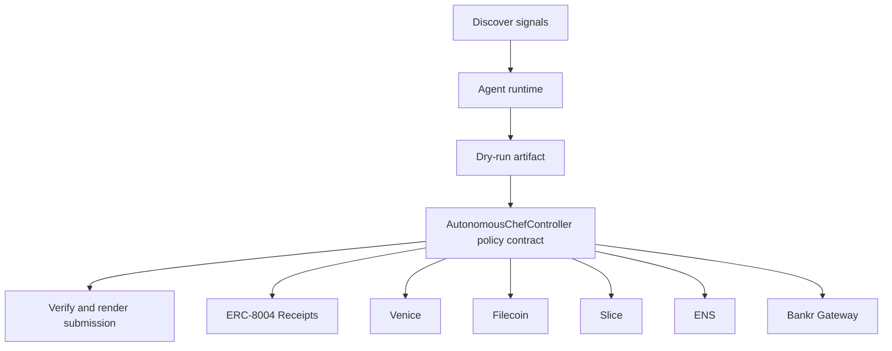

# Autonomous Public Goods Chef

- **Repo:** `Synthesis-Cook-NoHumansRequired`
- **Primary track:** Protocol Labs Let the Agent Cook
- **Category:** autonomy
- **Submission status:** implementation ready, waiting for credentials and TxIDs.

A no-human-input swarm that discovers public-goods funding gaps, plans a bounded intervention, executes a dry-run-validated action, verifies impact, and self-files receipts.

## Selected concept

A discover-plan-execute-verify loop monitors public-goods and treasury signals, drafts a bounded action, records a dry-run hash, and only then produces an execution bundle. The contract side stores action policies and proof commitments so the project demonstrates no-human-required behavior without pretending live keys exist.

## Idea shortlist

1. Octant Micro-Grant Chef
2. Status L2 Gasless Deployment Bot
3. Private Yield Reallocator

## Partners covered

ERC-8004 Receipts, Venice, Filecoin, Slice, ENS, Bankr Gateway, Lido

## Architecture



## Repository layout

- `src/`: shared policy contracts plus the repo-specific wrapper contract.
- `script/`: Foundry deployment entrypoint.
- `agents/`: Python runtime, partner adapters, and project metadata.
- `scripts/`: CLI utilities for running the loop and rendering submissions.
- `docs/`: architecture, credentials, demo script, and security notes.
- `submissions/`: generated `synthesis.md` snippet for this repo.

## Action catalog

| Action | Partner | Purpose | Max USD | Sensitivity |
| --- | --- | --- | --- | --- |
| `erc_8004_receipts_receipt_anchor` | ERC-8004 Receipts | Use ERC-8004 Receipts for a bounded action in this repo. | $1 | medium |
| `venice_private_analysis` | Venice | Use Venice for a bounded action in this repo. | $5 | high |
| `filecoin_proof_store` | Filecoin | Use Filecoin for a bounded action in this repo. | $20 | medium |
| `slice_checkout_hook` | Slice | Use Slice for a bounded action in this repo. | $35 | medium |
| `ens_ens_publish` | ENS | Use ENS for a bounded action in this repo. | $5 | low |
| `bankr_gateway_compute_route` | Bankr Gateway | Use Bankr Gateway for a bounded action in this repo. | $10 | high |
| `lido_yield_route` | Lido | Use Lido for a bounded action in this repo. | $200 | medium |

## Commands

```bash
python3 -m unittest discover -s tests
forge test
python3 scripts/run_agent.py
python3 scripts/plan_live_demo.py
python3 scripts/render_submission.py
```

## Credentials

| Partner | Variables | Docs |
| --- | --- | --- |
| ERC-8004 Receipts | RPC_URL | https://eips.ethereum.org/EIPS/eip-8004 |
| Venice | VENICE_API_KEY, VENICE_CHAT_COMPLETIONS_URL, VENICE_MODEL | https://docs.venice.ai/ |
| Filecoin | FILECOIN_API_TOKEN, FILECOIN_UPLOAD_URL | https://docs.filecoin.cloud/ |
| Slice | SLICE_API_KEY, SLICE_HOOK_URL | https://docs.slice.so/ |
| ENS | ENS_NAME | https://docs.ens.domains/ |
| Bankr Gateway | BANKR_API_KEY, BANKR_CHAT_COMPLETIONS_URL, BANKR_MODEL | https://bankr.bot/ |
| Lido | RPC_URL | https://docs.lido.fi/ |

## Live demo plan

1. Copy .env.example to .env and fill the required keys.
2. Deploy the contract with forge script script/Deploy.s.sol --broadcast for AutonomousChefController.
3. Run python3 scripts/run_agent.py to produce a dry run for autonomous_chef.
4. Set LIVE_MODE=true and rerun python3 scripts/run_agent.py with real credentials.
5. Run python3 scripts/render_submission.py and attach TxIDs plus repo links.
